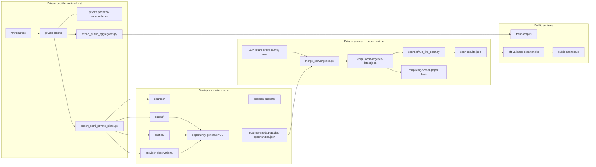

# puc-trading

Private runtime for the LLM Convergence flow-prediction thesis and related
paper-trade books. Houses the convergence artifact seam, the readonly options
scanner, the AGTI paper journal, the mispricing-screen paper options pipeline,
and deploy glue that pushes scanner output to the public dashboard.

See [`docs/DESIGN.md`](docs/DESIGN.md) for the architectural decisions: why
the runtime is split this way, how the file-boundary seam with `trend-corpus`
works, and how M1-M5 wire together.

## Canonical B2 architecture

The same diagram is embedded in `trend-corpus/README.md` and
`trend-intel-private/README.md`. This repo plays P3 -- the private scanner
runtime plus the local paper-trade consumers that read the convergence artifact.



Inside this repo: M and N feed O. The scanner Q reads O and writes R. The
mispricing-screen also reads O, joins it to dated catalysts, and writes a paper
book only. The deploy script in `scripts/deploy-scanner-results.sh` lifts R to
`P-U-C/pft-validator/scanner/scan-results.json` (P4 -> public dashboard).

Downstream of editorial (not shown in B2): each **Convergence Daily** episode is
forked through the **[convergence-hq dual-publishing engine](https://github.com/convergence-hq/convergence)**,
which emits a signed, immutable, agent-citable **Signal** object per episode — a
separate publishing surface that turns the corpus's calls into machine-citable record.

## Repo map

```
puc-trading/
|-- README.md                    <-- you are here
|-- Makefile                     <-- validate / test / populate-convergence / scan
|-- docs/
|   `-- DESIGN.md                <-- why this exists + how the pieces fit
|
|-- corpus/                      <-- the convergence corpus + populator (M1)
|   |-- capture-schema.ts        # TypeScript contract for capture + scoring
|   |-- convergence-corpus.md    # Phase 0 seed corpus writeup
|   |-- validation-plan.md       # backtesting methodology
|   |-- populate_convergence.py  # deterministic fixture-mode populator
|   |-- test_convergence_seam.py # tests for load / freshness / fail-loud paths
|   |-- convergence-latest.json  # the generated artifact the scanner consumes
|   `-- captures/YYYY-MM-DD/     # raw capture records, per-day partitioned
|
|-- scanner/                     <-- the live IBKR options scanner
|   |-- README.md                # scanner philosophy + setup
|   |-- ARCHITECTURE-HANDOFF.md  # integration contract for the corpus populator
|   |-- run_live_scan.py         # IB Gateway scanner, reads convergence-latest.json
|   |-- llm_options_scanner.py   # self-contained artifact + inline tests
|   |-- index.html               # local copy of the dashboard
|   `-- scan-results.json        # last scan output (real file lives in pft-validator)
|
|-- scripts/                     <-- deploy glue (M5)
|   |-- deploy-scanner-results.sh        # validate -> stage -> commit -> (DEPLOY_PUSH=1 to push)
|   |-- deploy-scanner-results.test.sh   # 4-test harness, no real git push
|   |-- refresh-mispricing.sh            # six-phase paper-only mispricing refresh
|   `-- check-dashboard-shape.py         # asserts scan-results.json fields the dashboard reads
|
|-- calendar/
|   `-- catalysts.yaml           <-- dated catalyst calendar for mispricing-screen
|
|-- mispricing/                  <-- two-bucket options paper pipeline
|   |-- README.md                # phase contracts + runtime state notes
|   |-- ib_chain.py              # IB Gateway primary, yfinance fallback
|   |-- detector.py              # thesis-vs-market mispricing rows
|   |-- shaper.py                # income / lottery sizing
|   |-- tickets.py               # daily markdown ticket writer
|   |-- morning_brief.py         # Telegram digest composer
|   |-- paper_executor.py        # paper positions + exits
|   `-- tests/
|
|-- trades/                      <-- active human-curated trade theses
|   |-- naval-thesis.md          # SaaSpocalypse short + hardware moats long
|   |-- ufo-disclosure.md        # release-day P&L log
|   `-- agti/                    # AGTI Intelligence Report trade theses
|
|-- journal/                     <-- daily trade diary (markdown per day)
|   `-- YYYY-MM-DD.md
|
|-- paper-journal/agti/          <-- automated AGTI paper-trade journal
|   |-- scripts/                 # daily-pull.sh, notify-telegram.py, extract-signals.py
|   |-- daily/                   # extracted signals + daily writeups
|   |-- daily/raw/               # raw AGTI HTML pulls
|   `-- cron-runs/               # cron run summaries
|
`-- paper-journal/mispricing/    <-- paper-only options book written by mispricing/
    |-- README.md
    |-- exit-rules.md
    `-- daily/
```

## Make targets

| Target | What it does |
|---|---|
| `make validate` | Validate `corpus/convergence-latest.json` against the M1 contract. Fails loud on missing / malformed / stale / empty. |
| `make test` | Run the corpus unittest suite. Mispricing tests live under `mispricing/tests/` and use pytest. |
| `make populate-convergence` | Regenerate `corpus/convergence-latest.json` + the day's capture-records (fixture mode, no API keys, no network). |
| `make scan` | `validate` + run `scanner/run_live_scan.py` against a live IB Gateway. |

## How it ties to the other repos

- The scanner writes `~/pft-validator/scanner/scan-results.json`, which is
  the file the public dashboard at `pft.permanentupperclass.com/scanner/`
  fetches. See [`pft-validator`](https://github.com/P-U-C/pft-validator).
- The convergence corpus model + schemas are mirrored in the public template
  at [`trend-corpus`](https://github.com/P-U-C/trend-corpus). The public repo
  documents the pattern; this repo is the live runtime.
- The AGTI paper journal in `paper-journal/agti/` is unrelated to the
  convergence scanner. It's the published-research-driven discretionary
  trade journal, cron'd daily at 14:00 UTC.
- The mispricing-screen in `mispricing/` is related to the convergence artifact
  but separate from the public scanner. It is paper-only until the 30-trade /
  30-day go-live gate is cleared and `LIVE_PUSH=1` is explicitly enabled.

## Bringup

```bash
git clone https://github.com/P-U-C/puc-trading.git
cd puc-trading
python3 -m pip install ib_insync requests  # only needed for live scans
make populate-convergence  # writes corpus/convergence-latest.json
make test
make validate
# scanning needs IB Gateway up on port 4002:
make scan
```

## Safety posture

- Scanner is `readonly=True` on the IBKR connection. No order methods exist.
- Convergence artifact is enforced fresh (default 14d) before any scan.
- Deploy glue does NOT push without explicit `DEPLOY_PUSH=1`. Secret-pattern
  scan runs before any commit.
- Position sizing is intentionally small. Scanner output is research ranking;
  mispricing is paper-only until its go-live gate is explicitly cleared.

Research infrastructure. Not financial advice.
