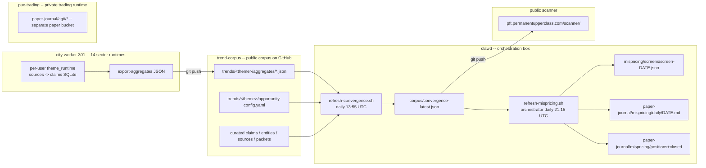

# SYSTEM Runbook -- the single operator-facing index

**As of:** 2026-05-18

The canonical "everything operates this way" doc. Read this first when:
- Onboarding a new operator (or coming back after a break)
- Something fails -- jump to **Operator action matrix** below
- Anyone asks "what does the system actually do?"

This doc is the **index**. Detailed specs live in the linked runbooks.
Keep this short and current; defer everything else to the linked docs.

---

## 1. System diagram



Three logical layers, three hosts, two GitHub repos.

| layer | what | where | git |
|---|---|---|---|
| **corpus generation** | 14 sector runtimes ingest + extract sources -> claims; export aggregates | city-worker-301 (192.168.1.21) | trend-corpus |
| **orchestration** | merge aggregates + score opportunities -> convergence; run mispricing pipeline | clawd (this box) | trend-corpus + puc-trading |
| **paper trading** | track AGTI signal bucket + mispricing-screen bucket | clawd | puc-trading |

---

## 2. Daily cadence (all UTC)

| time | host | job | output |
|---|---|---|---|
| 00:00 / 06:00 / 12:00 / 18:00 | city-worker | per-user `theme_runtime ingest` | sources table fills |
| 00:15 / 06:15 / 12:15 / 18:15 | city-worker | per-user `theme_runtime extract --limit 50` | claims table fills (via Claude Sonnet) |
| 05:00 | city-worker | per-user `theme_runtime sync` from trend-corpus | refresh sources.txt + prompts |
| 13:30-13:42 | city-worker | per-user `theme_runtime export-aggregates --commit-and-push` (staggered +1 min per user) | trend-corpus/trends/&lt;theme&gt;/aggregates/&lt;theme&gt;-aggregates.json |
| **13:55** | clawd | `refresh-convergence.sh` (DEPLOY_PUSH=1) | puc-trading/corpus/convergence-latest.json + git push |
| 14:00 | city-worker | per-user `theme_runtime notify digest` | Telegram digest per theme |
| 16:30 ET / 20:30 UTC EDT | _US market close_ | _(reference timing only)_ | _options chains settle_ |
| **21:15** | clawd | `refresh-mispricing.sh` (DEPLOY_PUSH=1, PREFER_SOURCE=yfinance) | mispricing/screens/screen-DATE.json + paper-journal/mispricing/daily/DATE.md + tracker.md + git push |
| Sunday 06:00 | city-worker | per-user `theme_runtime discover-entities --notify` | Telegram alert with new entity drafts |

**Two cron entries on clawd carry the whole orchestration**. See `~/puc-trading/ops/cron.d/puc-trading.cron` (canonical source) and `~/puc-trading/ops/cron.d/install.sh` (sentinel-based installer).

---

## 3. Component map -- what owns what

### City-worker users (14 sector runtimes)

| user | theme | corpus dir | log dir |
|---|---|---|---|
| peptide | peptides | `~/peptide-corpus/` | `/var/log/peptide-corpus/` |
| ai-infra | ai-infrastructure | `~/ai-infra-corpus/` | `~/logs/` |
| quantum | quantum-computing | `~/quantum-corpus/` | `~/logs/` |
| nuclear | nuclear-smr | `~/nuclear-corpus/` | `~/logs/` |
| robotics | robotics-humanoid | `~/robotics-corpus/` | `~/logs/` |
| defense | defense-ai | `~/defense-corpus/` | `~/logs/` |
| space | space-satellite | `~/space-corpus/` | `~/logs/` |
| bitcoin | bitcoin-mining | `~/bitcoin-corpus/` | `~/logs/` |
| bci | bci-neurotech | `~/bci-corpus/` | `~/logs/` |
| solidstate | solid-state-battery | `~/solidstate-corpus/` | `~/logs/` |
| synbio | synthetic-biology | `~/synbio-corpus/` | `~/logs/` |
| edgeai | edge-ai | `~/edgeai-corpus/` | `~/logs/` |
| photonic | photonic-computing | `~/photonic-corpus/` | `~/logs/` |
| longevity | longevity | `~/longevity-corpus/` | `~/logs/` |

Each user has its own `~/trend-corpus/` checkout (read + push). Per-user cron is at `/etc/cron.d/<user>-corpus`.

### Clawd orchestration paths

| file | role |
|---|---|
| `~/trend-corpus/scripts/refresh-convergence.sh` | 13:55 UTC convergence merge |
| `~/puc-trading/scripts/refresh-mispricing.sh` | 21:15 UTC mispricing pipeline (wraps `mispricing/orchestrator.py`) |
| `~/puc-trading/calendar/catalysts.yaml` | dated catalysts the detector joins against |
| `~/puc-trading/mispricing/orchestrator.py` | 7-phase transactional orchestrator (run-state/&lt;RUN-ID&gt; tmp + atomic rename) |
| `~/puc-trading/paper-journal/mispricing/` | mispricing paper bucket (tracker.md is rendered) |
| `~/puc-trading/paper-journal/agti/` | AGTI paper bucket (separate; see paper-journal/agti/README.md) |
| `~/puc-trading/logs/refresh-mispricing.log` | mispricing orchestrator log (NOT /tmp — survives reboot) |
| `~/puc-trading/run-state/<RUN-ID>/manifest.json` | per-run manifest with phase-by-phase status; 14-day retention |

---

## 4. Health-check commands

Run these in order when nothing has gone visibly wrong but you want a quick sanity pulse.

```bash
# 1. Both repos clean + at origin
cd ~/trend-corpus && git status --short && git log --oneline -1
cd ~/puc-trading && git status --short && git log --oneline -1

# 2. Tests pass (run from each repo)
cd ~/trend-corpus && make test            # 36 tests
cd ~/trend-corpus && make validate        # validation passed
cd ~/trend-corpus && PYTHONPATH=runtime python3 -m pytest runtime/tests -q
cd ~/puc-trading  && PYTHONPATH=. python3 -m pytest mispricing/tests -q  # 11 tests

# 3. Convergence freshness (should be ≤ 24h old after 13:55 UTC fires)
python3 -c "
import json, datetime
d=json.load(open('$HOME/puc-trading/corpus/convergence-latest.json'))
print(f'generated_at={d[\"generated_at\"]} themes={len(d[\"themes\"])} scores={len(d[\"scores\"])}')
"

# 4. Latest mispricing run manifest (clean = phases all OK)
ls -t ~/puc-trading/run-state/ | head -1 | xargs -I{} cat ~/puc-trading/run-state/{}/manifest.json | python3 -m json.tool | head -20

# 5. Sector aggregates pushed today
cd ~/trend-corpus && git log --since=24.hours.ago --oneline -- 'trends/*/aggregates/'

# 6. City-worker runtime health (sample one)
ssh city-worker-peptides "sudo tail -5 /home/ai-infra/logs/ai-infra-ingest.log"

# 7. Cron entries match the canonical
diff <(crontab -l | grep -E 'refresh-(convergence|mispricing)') ~/puc-trading/ops/cron.d/puc-trading.cron
```

---

## 5. Common failures + fixes

### 5.1 `[ai-infrastructure] ALERT ... sqlite3.IntegrityError: FOREIGN KEY constraint failed`

**Cause:** old code used `INSERT OR REPLACE INTO sources` which DELETE-then-INSERTs; once a runtime has claims referencing source.id the DELETE trips the FK.
**Fix:** patched in `trend-corpus@76b00fa` (UPSERT pattern). Verify the runtime has pulled:
```bash
ssh city-worker-peptides "sudo -iu ai-infra bash -lc 'cd ~/trend-corpus && git log --oneline -1'"
# should show 76b00fa or later
```
If not, propagate: `for u in ai-infra quantum nuclear robotics defense space bitcoin bci solidstate synbio edgeai photonic longevity; do ssh city-worker-peptides "sudo -iu $u bash -lc 'cd ~/trend-corpus && git pull --quiet --rebase'"; done`

### 5.2 Mispricing orchestrator phase fails mid-run

**Symptom:** Telegram alert `REFRESH FAILED run_id=YYYYMMDD...` with per-phase status table.
**Triage:**
1. Read the alert -- the failed phase is named.
2. `cat ~/puc-trading/run-state/<RUN-ID>/manifest.json` -- full error + artifacts.
3. Canonical paths untouched if phase 1-4 failed (transactional). If phase 5 (commit) failed, check whether positions.json was already mutated; rollback by `git checkout` if needed.
4. Re-run: `bash ~/puc-trading/scripts/refresh-mispricing.sh`

### 5.3 Convergence-latest is stale (>24h old after 13:55 UTC)

**Triage:**
```bash
tail -30 ~/trend-corpus/logs/refresh-convergence.log
crontab -l | grep refresh-convergence
```
Likely causes: cron disabled, trend-corpus push token rotated, opportunity-rows.json missing for one theme.
Manual run: `DEPLOY_PUSH=1 bash ~/trend-corpus/scripts/refresh-convergence.sh`

### 5.4 Telegram brief missing

The brief phase fails LOUD now (Codex follow-up). If you didn't get the morning brief at 21:15 UTC + the orchestrator says brief failed:
```bash
# Verify env present
echo "TG_BOT_TOKEN set: ${TG_BOT_TOKEN:+yes}"
echo "TG_CHAT_ID set:   ${TG_CHAT_ID:+yes}"
# Manual preflight
cd ~/puc-trading && PYTHONPATH=. python3 -c "from mispricing.morning_brief import preflight; preflight()"
```

### 5.5 IB Gateway down

Currently the system runs with `PREFER_SOURCE=yfinance` -- IB Gateway is OPTIONAL for the daily snapshot. If IBG is desired (for greeks):
```bash
# Check listener
ss -ntl | grep 4002
# Restart (boot cron @reboot exists)
nohup xvfb-run -a bash /home/ubuntu/ibc/gatewaystart.sh -inline >> /tmp/ib-launch.log 2>&1 &
```

### 5.6 GitHub push token rotated

Symptoms: any cron with DEPLOY_PUSH=1 fails with `Invalid username or token`.
Fix: get a fresh fine-grained PAT scoped to the target repo with contents:write. Then:
- For trend-corpus: re-run `~/pf-scout-bot/deploy/...` (see `~/.claude/projects/-home-ubuntu/memory/reference_pft_validator_repo.md` for the embedded-token pattern; same approach for other P-U-C repos)
- For sector runtime users: re-run the relevant `deploy-aggregates-all.sh` snippet with the new token to refresh `git remote set-url`

### 5.7 Cron entry drifted from canonical

```bash
diff <(crontab -l | grep -E 'refresh-(convergence|mispricing)') \
     <(grep -vE '^\s*(#|$)' ~/puc-trading/ops/cron.d/puc-trading.cron)
```
If divergent: `bash ~/puc-trading/ops/cron.d/install.sh` (will diff + ask for confirm).

---

## 6. Operator action matrix -- "what do I do when..."

| event | first action | escalate if |
|---|---|---|
| Daily mispricing brief arrives | Read NEW INCOME / NEW LOTTERY rows; decide whether to manually mirror in live IB (still paper-only until LIVE_PUSH=1 gate) | brief is empty for >3 consecutive days at any time |
| `[CODEX-REVIEW-DONE-*]` Telegram fires | Check the named plan file under `~/codex-prompts/*-PLAN.md`; review the commit(s) Codex pushed | Codex's plan disagrees with operator intent |
| `[business-guy]` Telegram fires | Check `~/business-guy/paper-journal/.../tracker.md` for the underlying signal | (business-guy isn't running on this box) |
| `ALERT <theme> ... ingest exit=1` | See 5.1 above (FK fix should have stopped this) | Same error on a runtime running ≥ 76b00fa |
| `REFRESH FAILED run_id=` | See 5.2 above | Phase 5 commit fails (potential paper-book corruption) |
| Hot reply on Telegram (IG/synbio/etc) | The reply is from a `mispricing-screen` paper context; check `~/puc-trading/paper-journal/mispricing/daily/<today>.md` for the originating ticket | The reply implies a live trade that wasn't paper-only |
| Going to bed / weekend | Verify: cron entries present, trend-corpus + puc-trading clean, latest manifest = success | Any of those three flags red |
| Coming back after a break | Run all the health-checks in §4; check the manifest from the last successful overnight run | Any phase has failed in the last 5 runs |
| Need to add a new theme | Follow `~/trend-corpus/ops/runbooks/add-new-theme.md` | -- |
| Need to add a new operator-side cron | Edit `~/puc-trading/ops/cron.d/puc-trading.cron`, run `install.sh` | -- |

---

## 7. Where to look for more detail

| topic | runbook |
|---|---|
| Bringing up a fresh box / installing deps | `trend-corpus/ops/runbooks/install.md` |
| Adding a new sector theme | `trend-corpus/ops/runbooks/add-new-theme.md` |
| Aggregates → scanner pipeline architecture | `trend-corpus/ops/runbooks/scanner-feed.md` |
| Aggregates bridge plan (sector + peptide variants) | `trend-corpus/ops/runbooks/sector-aggregates-bridge-plan.md`, `peptides-aggregates-bridge.md` |
| Mispricing strategy plan | `trend-corpus/ops/runbooks/mispricing-screen-plan.md` |
| Mispricing module phase contract | `puc-trading/mispricing/README.md` |
| Mispricing paper book contract | `puc-trading/paper-journal/mispricing/README.md` |
| Mispricing exit rules | `puc-trading/paper-journal/mispricing/exit-rules.md` |
| AGTI paper book contract | `puc-trading/paper-journal/agti/README.md` |
| AGTI exit rules | `puc-trading/paper-journal/agti/exit-rules.md` |
| Architectural decisions (B2 seam, etc.) | `puc-trading/docs/DESIGN.md` |
| business-guy automation stack | `business-guy/README.md` + `business-guy/ops/runbooks/bring-up.md` |
| Scanner integration / public scanner | `trend-corpus/ops/runbooks/scanner-integration.md` |
| Deploy cadence / release timing | `trend-corpus/ops/runbooks/deploy-cadence.md` |

---

## 8. Outstanding follow-ups (not blockers but on the radar)

- **`_thesis_move` calibration** before LIVE_PUSH=1 -- backtest the detector heuristic against historical catalyst moves + option-implied moves. Codex flagged as the highest-priority LIVE_PUSH precondition.
- **Branch protection on trend-corpus main** -- direct-push pattern works for one operator; add PR review when a second operator joins.
- **Versioned migration story for db.sqlite** -- `init_schema()` is additive/idempotent today; future FK/index/table changes need an explicit migration runbook.
- **Per-runtime ingest backoff** -- when a source URL fails consistently, the daily cron retries it 4×/day. Consider exponential backoff for chronically-failing sources.
- **OAuth-per-user step in install.md** -- task #43, still pending.

## 9. Quick reference card -- single-line commands

```bash
# Health
crontab -l | grep refresh                                          # cron armed?
ls -t ~/puc-trading/run-state/ | head -1                           # last run id
cd ~/puc-trading && PYTHONPATH=. python3 -m pytest mispricing/tests -q  # tests green?
cd ~/trend-corpus && make validate                                 # corpus valid?

# Manual triggers
DEPLOY_PUSH=1 bash ~/trend-corpus/scripts/refresh-convergence.sh   # rebuild convergence
DEPLOY_PUSH=1 PREFER_SOURCE=yfinance bash ~/puc-trading/scripts/refresh-mispricing.sh

# Telegram fail-loud
cd ~/puc-trading && PYTHONPATH=. python3 -c "from mispricing.morning_brief import preflight; print(preflight())"

# Push all sector runtimes to latest trend-corpus
for u in ai-infra quantum nuclear robotics defense space bitcoin bci solidstate synbio edgeai photonic longevity; do
    ssh city-worker-peptides "sudo -iu $u bash -lc 'cd ~/trend-corpus && git pull --quiet --rebase'"
done
```
